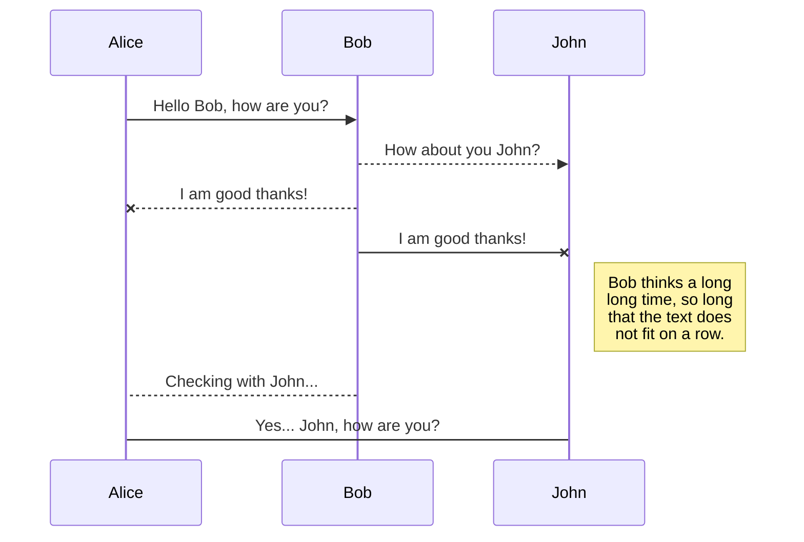
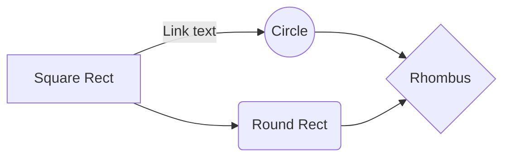

# Welcome to  Utility Library for JavaScript!
This npm package provides a versatile utility library for JavaScript developers, encompassing essential functionalities for array manipulation, conditional loops, date formatting, and string manipulation.
# Utility Library for JavaScript
This npm package provides a versatile utility library for JavaScript developers, encompassing essential functionalities for array manipulation, conditional loops, date formatting, and string manipulation.
# Installation
You can install the package via npm:
`npm install utilitylibrary-js` 
# Import
Import in your project:
`import { utilityLibrary } from  "utilitylibrary-js";`
##  Usage
### Array Methods:
Example Array :
const myArray = [1, 2, 3, 4, 5, 3, 2];
1. **isEmpty(arr):** Checks if an array is empty.
Example:
console.log("Is the array empty?", utilityLibrary.array.isEmpty(myArray));
//Is the array empty? false
2. **contains(arr, element):** Checks if an array contains a specific element.
Example
console.log("Does the array contain3?",utilityLibrary.array.contains(myArray, 3));
//Does the array contain 3? true
3. **removeDuplicates(arr):** Removes duplicates from an array.
Example:
console.log("Unique elements in the array:",utilityLibrary.array.removeDuplicates(myArray));
//Unique elements in the array:[1,2,3,4,5]
4. **flatten(arr):** Flattens a nested array.
Example:
console.log("Flattened array:",utilityLibrary.array.flatten([[1, 2],[3, 4],[5, 6],]));
//Flattened array: [ 1, 2, 3, 4, 5, 6 ]
5. **shuffle(arr):** Shuffles the elements of an array.
Example:
console.log("Shuffled array:", utilityLibrary.array.shuffle(myArray));
//Shuffled array: [ 2, 3, 4, 5,3, 2, 1]
6. **sum(arr):** Calculates the sum of all elements in an array.
Example:
console.log("Sum of array elements:", utilityLibrary.array.sum(myArray));
//Sum of array elements: 20
7. **average(arr):** Calculates the average of all elements in an array.
 Example:
 console.log("Average of array elements:",utilityLibrary.array.average(myArray));
 //Average of array elements: 2.857142857142857
 8. **max(arr):** Finds the maximum element in an array.
 Example:
 console.log("Maximum element in the array:", utilityLibrary.array.max(myArray));
 Example:
 //Maximum element in the array: 5
 9. **min(arr):** Finds the minimum element in an array.
 Example:
 console.log("Minimum element in the array:", utilityLibrary.array.min(myArray));
 //Minimum element in the array: 1
 
  10. **filter() method:** takes a callback function as an argument and returns a new array.
  Example:
  const evenNumbers = utilityLibrary.loop.filter(myArray, num => num % 2 === 0); console.log("Even numbers:", evenNumbers);
  //[2,4,2]
  11. **map() method:**  iterates over an array and applies a callback function to each element& returns a new array containing the transformed elements.
  Example:
  const  squaredNumbers  =  utilityLibrary.array.map(myArray,(number) =>  number  *  number);
  console.log(squaredNumbers);
  //[ 1, 4, 9, 16, 25, 9, 4]
  12. **forEach() method:** takes a callback function as an argument and applies it to each element of the array.
  Example:
  utilityLibrary.array.forEach(myArray, (number) =>  console.log(number  *  number));
  //1
4
9
16
25
9
4
### Conditional Loops
**forEach() loop:**
const  myArray  = [1, 2, 3, 4, 5, 3, 2];
utilityLibrary.loop.forEach(myArray, (num) =>  console.log("Number:", num));
//Number: 1
Number: 2
Number: 3
Number: 4
Number: 5
Number: 3
Number: 2
### Date Formatting
1. **formatDate(date, format):** Formats a date object according to the specified format.
Example:
const  currentDate  =  new  Date();//Sun Mar 03 2024 11:43:49 GMT+0530 (India Standard Time)
console.log("Formatted date:", utilityLibrary.formatDate(currentDate));
//Formatted date: March 3, 2024 at 11:43:03
### String Manipulation
Example String:
const  myString  =  "hello world";
1. **capitalize(str):** Capitalizes the first letter of a string.
Example:
console.log("Capitalized string:", utilityLibrary.string.capitalize(myString));
//Capitalized string: Hello world
2. **reverse(str):** Reverses a string.
Example:
console.log("Reversed string:", utilityLibrary.string.reverse(myString));
//Reversed string: dlrow olleh
3. **truncate(str, length):** Truncates a string to a specified length.
Example:
console.log("Truncated string:", utilityLibrary.string.truncate(myString, 5));
//Truncated string: hello...
4. **countOccurrences(str, substring):** Counts the occurrences of a substring within a string.
Example:
console.log("Word count:", utilityLibrary.string.countWords(myString));
//Word count: 2
5. **removeWhitespace(str):** Removes whitespace from the beginning and end of a string.
Example:
console.log("whiteSpace Removed:",utilityLibrary.string.removeWhitespace(myString));
//whiteSpace Removed: helloworld
6. **replace() method** searches a string for a value or a regular expression& returns new string but not changes original string.
Example:
const  replacedString  =  utilityLibrary.string.replace(myString,"world",
"javascript");
console.log("Replaced string:", replacedString);
//Replaced string: hello javascript
## Contributing
Contributions are welcome! Please feel free to submit issues or pull requests on the GitHub repository(https://github.com/mrshri/utilitylibrary-js).
## License
This project is licensed under the Apache-2.0 License - see the LICENSE file for details.

#   Utility Library for JavaScript

This npm package provides a versatile utility library for JavaScript developers, encompassing essential functionalities for array manipulation, conditional loops, date formatting, and string manipulation.

## Installation

You can install the package via npm:

bashCopy code

`npm install js-utility-library` 

## Usage

### Array Methods

-   **isEmpty(arr):** Checks if an array is empty.
-   **contains(arr, element):** Checks if an array contains a specific element.
-   **removeDuplicates(arr):** Removes duplicates from an array.
-   **flatten(arr):** Flattens a nested array.
-   **shuffle(arr):** Shuffles the elements of an array.
-   **sum(arr):** Calculates the sum of all elements in an array.
-   **average(arr):** Calculates the average of all elements in an array.
-   **max(arr):** Finds the maximum element in an array.
-   **min(arr):** Finds the minimum element in an array.

### Conditional Loops

### Date Formatting

-   **formatDate(date, format):** Formats a date object according to the specified format.

## Rename a file

You can rename the current file by clicking the file name in the navigation bar or by clicking the **Rename** button in the file explorer.

## Delete a file

You can delete the current file by clicking the **Remove** button in the file explorer. The file will be moved into the **Trash** folder and automatically deleted after 7 days of inactivity.

## Export a file

You can export the current file by clicking **Export to disk** in the menu. You can choose to export the file as plain Markdown, as HTML using a Handlebars template or as a PDF.

# Synchronization

Synchronization is one of the biggest features of StackEdit. It enables you to synchronize any file in your workspace with other files stored in your **Google Drive**, your **Dropbox** and your **GitHub** accounts. This allows you to keep writing on other devices, collaborate with people you share the file with, integrate easily into your workflow... The synchronization mechanism takes place every minute in the background, downloading, merging, and uploading file modifications.

There are two types of synchronization and they can complement each other:

- The workspace synchronization will sync all your files, folders and settings automatically. This will allow you to fetch your workspace on any other device.
	> To start syncing your workspace, just sign in with Google in the menu.

- The file synchronization will keep one file of the workspace synced with one or multiple files in **Google Drive**, **Dropbox** or **GitHub**.
	> Before starting to sync files, you must link an account in the **Synchronize** sub-menu.

## Open a file

You can open a file from **Google Drive**, **Dropbox** or **GitHub** by opening the **Synchronize** sub-menu and clicking **Open from**. Once opened in the workspace, any modification in the file will be automatically synced.

## Save a file

You can save any file of the workspace to **Google Drive**, **Dropbox** or **GitHub** by opening the **Synchronize** sub-menu and clicking **Save on**. Even if a file in the workspace is already synced, you can save it to another location. StackEdit can sync one file with multiple locations and accounts.

## Synchronize a file

Once your file is linked to a synchronized location, StackEdit will periodically synchronize it by downloading/uploading any modification. A merge will be performed if necessary and conflicts will be resolved.

If you just have modified your file and you want to force syncing, click the **Synchronize now** button in the navigation bar.

> **Note:** The **Synchronize now** button is disabled if you have no file to synchronize.

## Manage file synchronization

Since one file can be synced with multiple locations, you can list and manage synchronized locations by clicking **File synchronization** in the **Synchronize** sub-menu. This allows you to list and remove synchronized locations that are linked to your file.

# Publication

Publishing in StackEdit makes it simple for you to publish online your files. Once you're happy with a file, you can publish it to different hosting platforms like **Blogger**, **Dropbox**, **Gist**, **GitHub**, **Google Drive**, **WordPress** and **Zendesk**. With [Handlebars templates](http://handlebarsjs.com/), you have full control over what you export.

> Before starting to publish, you must link an account in the **Publish** sub-menu.

## Publish a File

You can publish your file by opening the **Publish** sub-menu and by clicking **Publish to**. For some locations, you can choose between the following formats:

- Markdown: publish the Markdown text on a website that can interpret it (**GitHub** for instance),
- HTML: publish the file converted to HTML via a Handlebars template (on a blog for example).

## Update a publication

After publishing, StackEdit keeps your file linked to that publication which makes it easy for you to re-publish it. Once you have modified your file and you want to update your publication, click on the **Publish now** button in the navigation bar.

> **Note:** The **Publish now** button is disabled if your file has not been published yet.

## Manage file publication

Since one file can be published to multiple locations, you can list and manage publish locations by clicking **File publication** in the **Publish** sub-menu. This allows you to list and remove publication locations that are linked to your file.

# Markdown extensions

StackEdit extends the standard Markdown syntax by adding extra **Markdown extensions**, providing you with some nice features.

> **ProTip:** You can disable any **Markdown extension** in the **File properties** dialog.

## SmartyPants

SmartyPants converts ASCII punctuation characters into "smart" typographic punctuation HTML entities. For example:

|                |ASCII                          |HTML                         |
|----------------|-------------------------------|-----------------------------|
|Single backticks|`'Isn't this fun?'`            |'Isn't this fun?'            |
|Quotes          |`"Isn't this fun?"`            |"Isn't this fun?"            |
|Dashes          |`-- is en-dash, --- is em-dash`|-- is en-dash, --- is em-dash|

## KaTeX

You can render LaTeX mathematical expressions using [KaTeX](https://khan.github.io/KaTeX/):

The *Gamma function* satisfying $\Gamma(n) = (n-1)!\quad\forall n\in\mathbb N$ is via the Euler integral

$$
\Gamma(z) = \int_0^\infty t^{z-1}e^{-t}dt\,.
$$

> You can find more information about **LaTeX** mathematical expressions [here](http://meta.math.stackexchange.com/questions/5020/mathjax-basic-tutorial-and-quick-reference).

## UML diagrams

You can render UML diagrams using [Mermaid](https://mermaidjs.github.io/). For example, this will produce a sequence diagram:

And this will produce a flow chart:

